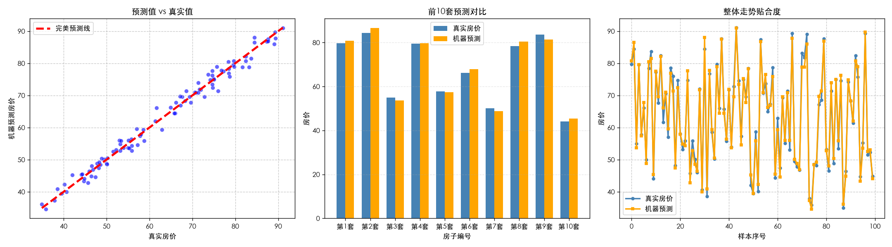

# 从零学 PyTorch（小白实战笔记）

> 一份面向**零基础 / 工程背景**学习者的 PyTorch 上手仓库。不堆公式，先跑通、再讲透。
> 用一条「房价预测」主线贯穿：从张量 → 自动求导 → 手写回归 → 标准化 → 收敛。

---

## 适合谁 / 前置条件

- 会一点 Python（函数、类、列表推导）和 NumPy 基础即可，数学用到再补。
- 不需要先啃《花书》或机器学习理论，边跑边学。
- 推荐教材（边读边跑）：[动手学深度学习 d2l 中文版](https://zh.d2l.ai/)

---

## 环境准备

使用 [uv](https://github.com/astral-sh/uv) 管理环境与依赖（比 pip+venv 更快、可复现，自动生成 `uv.lock`）。

```bash
# 安装 uv（如未安装）
curl -LsSf https://astral.sh/uv/install.sh | sh   # 或 brew install uv

# 进入本仓库后，一键复原环境
uv sync

# 验证 PyTorch 与可用后端
uv run python -c "import torch; print(torch.__version__, torch.backends.mps.is_available())"
```

### GPU 后端说明（很重要，少踩坑）

| 硬件 | 后端 | 备注 |
|---|---|---|
| Apple Silicon（Mac M4 等） | **MPS** | PyTorch 自带，`mps.is_available()` 直接为 `True`，无需额外驱动 |
| NVIDIA 显卡 | **CUDA** | `cuda.is_available()` |
| AMD 显卡（如 RX 6600） | **ROCm** | 消费级卡常不在官方白名单，需 `HSA_OVERRIDE_GFX_VERSION` 等额外配置；**学习阶段建议先用 CPU** |

本仓库示例默认 `device = 'cpu' / 'mps' / 'cuda'` 自动探测，不强依赖 GPU，CPU 即可跑完所有教程。

---

## 项目结构

```text
torch_demon/
├── README.md              # 本文件：总览 + 环境 + 学习路线 + 踩坑笔记
├── pyproject.toml         # uv 项目配置（torch / torchvision / matplotlib / numpy）
├── uv.lock                # 锁定依赖版本，保证可复现
├── main.py                # 综合实战：多变量房价预测（= lessons/03_regression.py）
├── house_price_v2.png     # main.py 输出的可视化结果
├── data/                  # 学习用的数据集（已落盘，可复现）
│   ├── generate_house_price_data.py  # 生成数据集（固定 seed=42）
│   ├── house_price.pt                # PyTorch 原生格式（X_raw / y_data）
│   └── house_price.csv               # 人可读格式，便于检视
├── lessons/
│   ├── 01_tensor.py       # 阶段1：张量基础
│   ├── 01_tensor.md       # 阶段1 讲解
│   ├── 02_autograd.py     # 阶段2：自动求导 autograd
│   ├── 02_autograd.md     # 阶段2 讲解
│   ├── 02_intuition.py    # 阶段2 补充：用"推一下"理解导数（给初学者）
│   ├── 03_regression.py   # 阶段3：房价回归（与根目录 main.py 一致）
│   ├── 03_regression.md   # 阶段3 讲解
│   ├── 04_template.py     # 阶段4：工业级模板（nn.Module + DataLoader + state_dict）
│   ├── 04_template.md     # 阶段4 讲解
│   ├── 05_classification.py   # 阶段5：分类任务（单层 2→16→3，99 参数，基线）
│   ├── 05_classification.md    # 阶段5 讲解
│   ├── 05b_deeper.py           # 阶段5 加深对照：3 隐藏层 2→64→32→16→3（2851 参数）
│   └── 05b_deeper.md           # 阶段5 加深讲解（如何加层 + 核对参数量）
└── .venv/                 # 虚拟环境（已被 .gitignore 忽略）
```

---

## 学习路线

| 阶段 | 主题 | 文件 | 过关标准 |
|---|---|---|---|
| 1 | 张量 Tensor | `lessons/01_tensor.py` | 能不查文档写出 reshape/广播并说清形状 |
| 2 | 自动求导 autograd | `lessons/02_autograd.py`（直觉见 `02_intuition.py`） | 能口述 `backward()→.grad→zero_grad` 流程 |
| 3 | 线性回归实战 | `lessons/03_regression.py`（= `main.py`） | 学出的系数接近真实规律，能解释"标签为何也要标准化" |
| 4 | 工业级模板 | `lessons/04_template.py` | 能用 `nn.Module`+`DataLoader` 重写阶段3，训练循环五步顺序口述无误，测试集 R²≈0.99 |
| 5 | 分类任务 Classification | `lessons/05_classification.py` | 能说清 `CrossEntropyLoss` 与 `MSELoss` 区别、输出维度=类别数、用 `argmax`+准确率评估 |
| 5b | 分类·加深对照 | `lessons/05b_deeper.py` | 能动手加隐藏层、保证维度链 `in/out` 接力、手算参数量（2→64→32→16→3 = 2851） |

---

## 快速开始

```bash
# 逐课运行
uv run lessons/01_tensor.py
uv run lessons/02_autograd.py
uv run lessons/02_intuition.py

# 综合实战：多变量房价预测（收敛版）
uv run main.py

# 阶段4：工业级标准模板（nn.Module + DataLoader + 保存加载 + 测试集评估）
uv run lessons/04_template.py

# 阶段5：分类任务（玩具数据，零下载依赖，输出决策边界图 classification_result.png）
uv run lessons/05_classification.py

# 阶段5 加深对照：3 隐藏层深网络（对比单层基线）
uv run lessons/05b_deeper.py
```

`uv run main.py` 会输出训练过程、学出的规律（≈ `0.49*面积 + 2.07*房间 - 1.53*地铁 + 10.9`，贴合真实 `0.5/2.0/-1.5/10`），并保存 `house_price_v2.png`：



`uv run lessons/04_template.py` 则把同一道题重写成工业级模板：用 `nn.Module` 定义网络、`DataLoader` 小批量训练、划分 train/test 并报告 **R²≈0.99**、演示 `state_dict` 保存与加载。这是后续写任何网络（CNN/RNN/Transformer）都通用的骨架。

---

## 数据文件

房价预测用的数据集已落盘在 `data/`，不依赖运行时随机生成：

- `data/house_price.pt` — PyTorch 原生格式（`torch.load` 后是一个 dict，含 `X_raw`、`y_data`、特征名），阶段 4 训练时优先从这里加载。
- `data/house_price.csv` — 人可读的 100 行数据（面积 / 房间数 / 地铁距离 / 房价），可在 Excel 或编辑器里直接看。
- `data/generate_house_price_data.py` — 数据生成脚本，固定 `seed=42`，保证可复现。

```bash
# 重新生成数据集（可选）
uv run python data/generate_house_price_data.py
```

---

## 踩坑笔记（都是真金白银换来的）

1. **标签要用原始特征生成，归一化只作用于输入 X。**
   用「归一化后的 X」去算 y，弱信号特征（面积）会被噪声淹没，系数直接学成 0。
2. **输入 X 和标签 y 都要标准化。**
   只标准化 X、y 均值高达 ~62 时，Adam 的有效步长 ≈ `lr`，截距要从 0 爬到 62，需 6000+ 步；2000 步根本没收敛（loss 停在 3100）。把 y 也标准化，几十步就收敛。
3. **梯度会累加，每个 batch 更新前必须 `zero_grad()`。**
4. **早停 / 学习率衰减是加速器，不是必需品**——先用最简单的跑通，再叠加。

---

## 参考

- 动手学深度学习（d2l）：https://zh.d2l.ai/
- PyTorch 官方教程：https://pytorch.org/tutorials/

## 许可证

MIT（可自行修改、分发）。
